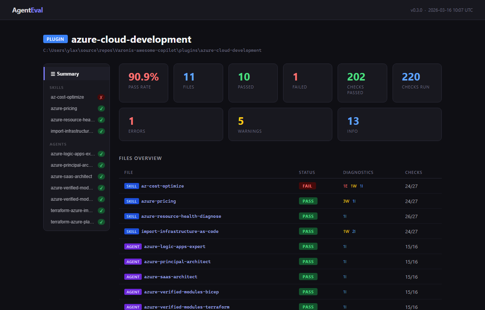
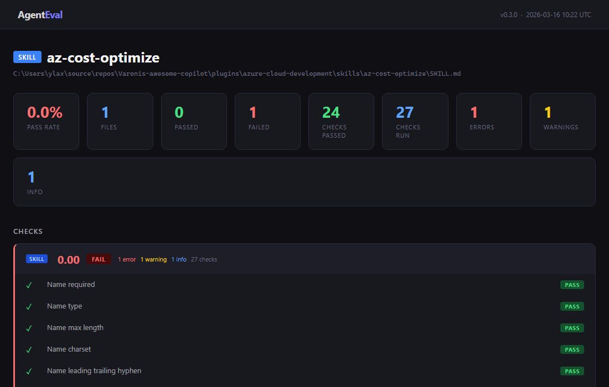
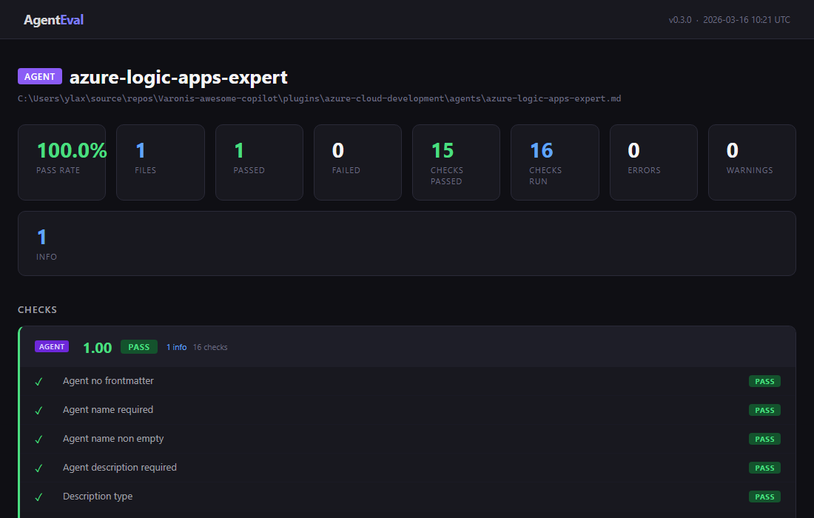
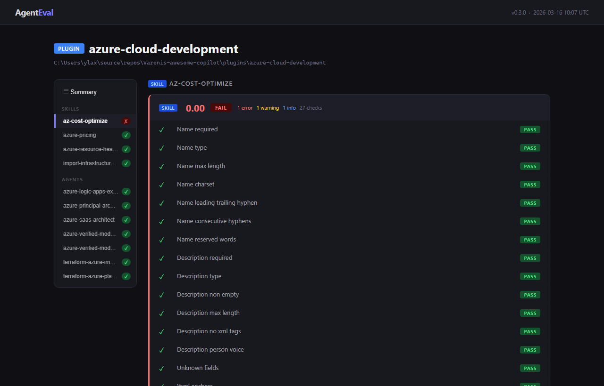

<div align="center">

<br/>

# AgentEval

**Cross-agent quality gate for `SKILL.md` and `agent.md` files.**<br/>
Spec validation, description scoring, reference checks, and cross-platform compatibility warnings — all in one tool. Based on the [agentskills.io specification](https://agentskills.io/specification).

<br/>



<br/>

</div>

---

## What It Does

`AgentEval` catches problems in your `SKILL.md` and `agent.md` files before they reach production across Claude Code, VS Code/Copilot, OpenAI Codex, Cursor, and other agents:

- **Frontmatter validation** -- required fields, type checks, length limits, reserved words, first/second-person voice, XML tags, and unknown fields
- **Name compliance** -- hyphen rules, consecutive-hyphen checks, and directory-name matching (VS Code silently drops skills that don't match)
- **Description quality scoring** -- scores 0-100 on action verbs, trigger phrases, keyword density, and length; a weak description means agents never activate the skill
- **File reference validation** -- verifies relative references exist on disk and stay within one level of the skill file
- **Token budget checks** -- validates the three-tier budget (metadata ~100 tokens, body <5000 tokens, resources on demand) and flags oversized code blocks, tables, and embedded base64
- **Cross-agent compatibility warnings** -- highlights Claude Code-only fields, VS Code directory requirements, and unverified behavior in Codex and Cursor
- **CI-friendly** -- JSON output, deterministic exit codes, zero config

## Install

```bash
pip install agenteval
```

Or install from source with dev dependencies:

```bash
pip install -e ".[dev]"
```

## Quick Start

```bash
# Validate a single file
agenteval path/to/SKILL.md

# Scan a directory recursively for all SKILL.md files
agenteval skills/

# Scan a whole plugin (multiple skills) — generates a tabbed HTML report
agenteval plugins/my-plugin/

# Machine-readable output for CI pipelines
agenteval skills/ --format json

# Score description quality with a minimum threshold
agenteval SKILL.md --min-desc-score 50

# Check compatibility for a specific agent
agenteval SKILL.md --target-agent vscode --strict-vscode

# Skip checks that need filesystem context (useful in CI)
agenteval SKILL.md --skip-dirname-check --skip-ref-check
```

## GitHub Action

Add AgentEval to any CI pipeline in three lines:

```yaml
# .github/workflows/skills.yml
name: Skill Validation
on: [push, pull_request]

jobs:
  agenteval:
    runs-on: ubuntu-latest
    steps:
      - uses: actions/checkout@v4
      - uses: YoavLax/agenteval@v0
        with:
          path: .github/skills/
```

That's it. Failures block the PR, diagnostics appear inline on the diff, and a summary table is added to the job.

### Action Inputs

| Input | Default | Description |
|---|---|---|
| `path` | `.` | Path to a SKILL.md file or directory to scan recursively |
| `version` | latest | Pin a specific AgentEval version (e.g., `0.3.0`) |
| `min-desc-score` | | Minimum description quality score (0-100) |
| `target-agent` | `all` | Scope compat checks: `claude`, `vscode`, or `all` |
| `strict-vscode` | `false` | Promote VS Code compat issues to errors |
| `skip-dirname-check` | `false` | Skip directory-name matching check |
| `skip-ref-check` | `false` | Skip file reference validation |
| `ignore` | | Comma-separated rule prefixes to suppress |
| `max-lines` | `500` | Override line-count threshold |
| `max-tokens` | `8000` | Override token-count threshold |

### Action Outputs

| Output | Description |
|---|---|
| `exit-code` | `0` = pass, `1` = errors, `2` = input error |
| `json` | Full JSON output from AgentEval |

### What You Get

- **PR annotations** that put errors and warnings inline on the diff
- **Job summary** with a Markdown results table on the workflow run page
- **Exit code gating** so the step fails if any skill has errors

### Examples

Strict VS Code mode with a description quality floor:

```yaml
- uses: YoavLax/agenteval@v0
  with:
    path: skills/
    strict-vscode: true
    min-desc-score: 60
```

Use the JSON output in a downstream step:

```yaml
- uses: YoavLax/agenteval@v0
  id: check
  with:
    path: SKILL.md
- run: echo '${{ steps.check.outputs.json }}' | jq .files_failed
```

## Example Output

**Single-file report (skill)**



**Single-file report (agent)**



**Plugin report — detail view**



**Terminal output**

```
✔ PASS  skills/deploy/SKILL.md
            · info              description.quality-score  Description quality score: 85/100.

✗ FAIL  skills/pdf-tool/SKILL.md
  line 2  ✗ error    frontmatter.name.directory-mismatch  Name 'pdf-processor' does not match parent directory 'pdf-tool'.
  line 3  ⚠ warning  frontmatter.field.unknown            Unknown field 'author'.
          · info     description.quality-score            Description quality score: 45/100.
                     Suggestions: Start with an action verb; Add trigger phrases.
          · info     compat.claude-only                   Field 'model' is Claude Code-specific.

Checked 2 files: 1 passed, 1 failed, 1 warning
```

## Options

| Flag | Description |
|---|---|
| `--format json` | Machine-readable JSON output |
| `--max-lines N` | Override line-count threshold (default: 500) |
| `--max-tokens N` | Override token-count threshold (default: 8000) |
| `--ignore PREFIX` | Suppress rules matching a prefix (repeatable) |
| `--no-color` | Disable colored output |
| `-q`, `--quiet` | Suppress all output; exit code only (for CI) |
| `--skip-dirname-check` | Skip directory-name matching (useful for CI temp paths) |
| `--skip-ref-check` | Skip file reference validation |
| `--min-desc-score N` | Minimum description quality score (0-100); below triggers a warning |
| `--target-agent NAME` | Scope compat checks: `claude`, `vscode`, or `all` (default: `all`) |
| `--strict-vscode` | Promote VS Code compat issues to errors |
| `--html [FILE]` | Write HTML report to FILE (default: `agenteval-report.html`) |
| `--no-html` | Disable automatic HTML report generation |
| `--version` | Show version |

### Examples

```bash
# Override sizing thresholds
agenteval skills/ --max-lines 800 --max-tokens 6000

# Suppress specific rule categories
agenteval SKILL.md --ignore frontmatter.description

# Require description quality above 60
agenteval SKILL.md --min-desc-score 60

# Check only Claude Code compatibility
agenteval SKILL.md --target-agent claude

# Strict VS Code mode (name must match directory or exit 1)
agenteval SKILL.md --strict-vscode

# Pipe-friendly plain output
agenteval SKILL.md --no-color

# Silent mode for CI (exit code only)
agenteval SKILL.md --quiet

# Generate HTML report at a custom path
agenteval skills/ --html reports/skills.html
```

## Exit Codes

| Code | Meaning |
|---|---|
| `0` | No errors (warnings and info are allowed) |
| `1` | One or more errors found |
| `2` | Input error (missing file, empty directory) |

## Rules

Rules marked **spec** are derived from the [agentskills.io specification](https://agentskills.io/specification) or agent-specific documentation. Rules marked **advisory** are best-practice recommendations enforced by AgentEval.

| Rule ID | Severity | Source | What it checks |
|---|---|---|---|
| `frontmatter.name.required` | error | spec | `name` field must exist |
| `frontmatter.name.type` | error | advisory | `name` must be a string (catches YAML coercion of `true`, `123`, `null`) |
| `frontmatter.name.max-length` | error | spec | Name must be 64 characters or fewer |
| `frontmatter.name.invalid-chars` | error | spec | Lowercase, numbers, hyphens only |
| `frontmatter.name.leading-trailing-hyphen` | error | spec | No leading or trailing hyphens |
| `frontmatter.name.consecutive-hyphens` | error | spec | No consecutive hyphens |
| `frontmatter.name.reserved-word` | error | advisory | Not a reserved word (`claude`, `anthropic`) |
| `frontmatter.name.directory-mismatch` | error | spec | Name must match parent directory (VS Code requirement) |
| `frontmatter.description.required` | error | spec | `description` field must exist |
| `frontmatter.description.type` | error | advisory | `description` must be a string (catches YAML coercion) |
| `frontmatter.description.empty` | error | spec | Description must not be blank |
| `frontmatter.description.max-length` | error | spec | Description must be 1024 characters or fewer |
| `frontmatter.description.xml-tags` | error | advisory | No XML/HTML tags in description |
| `frontmatter.description.person-voice` | error | advisory | No first/second-person pronouns |
| `frontmatter.field.unknown` | warning | advisory | Flags fields not in the spec |
| `frontmatter.yaml-anchors` | warning | advisory | YAML anchors/aliases can silently copy values |
| `description.quality-score` | info | advisory | Scores description 0-100 for agent discoverability |
| `description.min-score` | warning | advisory | Description score below `--min-desc-score` threshold |
| `sizing.body.line-count` | warning | spec | File exceeds line threshold |
| `sizing.body.token-estimate` | warning | spec | File exceeds token threshold |
| `disclosure.metadata-budget` | warning | spec | Frontmatter exceeds ~100 token metadata budget |
| `disclosure.body-budget` | warning | spec | Body exceeds 5000 token instruction budget |
| `disclosure.body-bloat` | info | advisory | Large code blocks, tables, or base64 in body |
| `references.broken-link` | error | advisory | Referenced file does not exist |
| `references.escape` | error | advisory | Reference resolves outside skill directory (CWE-59) |
| `references.depth-exceeded` | warning | spec | Reference deeper than one level from SKILL.md |
| `compat.claude-only` | info | spec | Field only works in Claude Code |
| `compat.vscode-dirname` | info/error | spec | Name does not match parent directory (VS Code) |
| `compat.unverified` | info | advisory | Field behavior unverified in Codex/Cursor |

## Limitations

- Token counts are estimates. The heuristic fallback has ~15% error; install `tiktoken` for ~5% error. Neither matches Claude's exact tokenizer (not publicly available).
- Cross-agent compatibility data for Codex and Cursor is based on available documentation as of early 2026. Fields marked "unverified" may work, may be ignored, or may cause issues. File bugs if you find discrepancies.
- Description quality scoring uses heuristics, not an LLM. It catches common patterns (missing action verbs, no trigger phrases, vague words) but cannot evaluate semantic quality.
- Directory-name matching compares against the immediate parent directory. If your CI clones into a temp path, use `--skip-dirname-check`.
- File reference validation only checks references extractable from markdown link syntax and `source:`/`file:` directives. Arbitrary path strings in prose are not detected.

## Testing

```bash
pip install -e ".[dev]"
python3 -m pytest tests/ -v
```

## License

MIT
